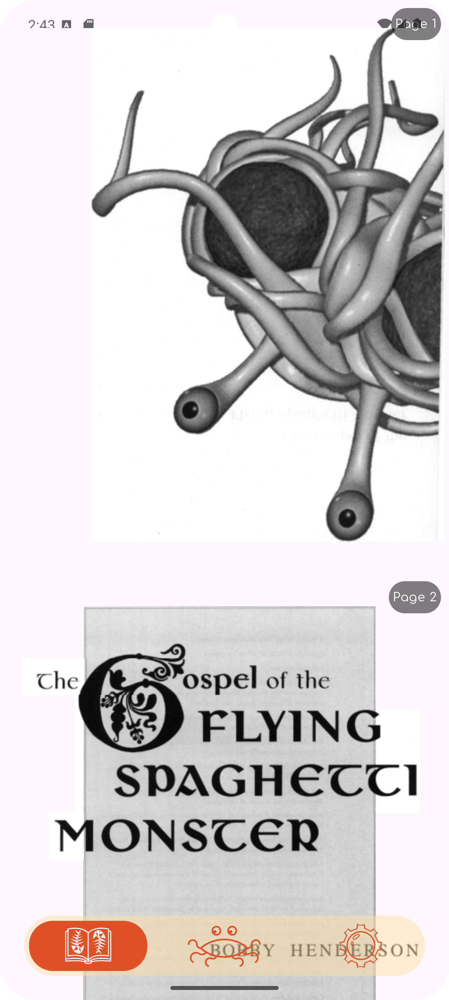
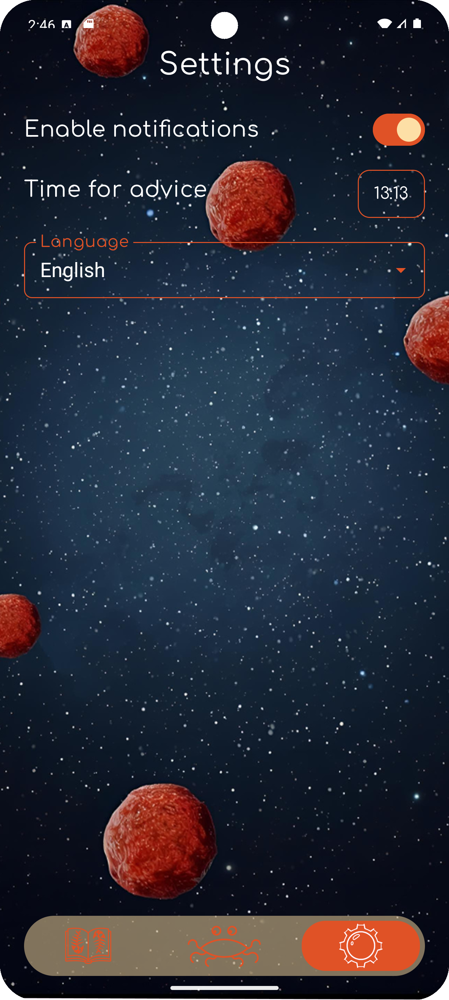

**FlyingSpaghettiWisdom** — An Android app that contains sacred texts, quotes, and a little wisdom from the FSM. You can get a notification with your daily advice 🙂.

---

## 📸 Screenshots

<p align="center">
  
  
  
</p>
---

## 🔧 Build Instructions

This project uses **Gradle** for building.

1. Clone the repository:
   ```bash
   git clone https://github.com/mafusaik/FlyingSpaghettiWisdom.git
   cd FlyingSpaghettiWisdom
2. Build the release APK:
  ./gradlew assembleRelease
3. The generated APK will be located in:
  app/build/outputs/apk/release/

## Support / Donate

If you like this project, you can support development via:

- USDT (TRC20) TStFrPQjTMMoMVF8TMUMxdeti5hfSkMRFp
